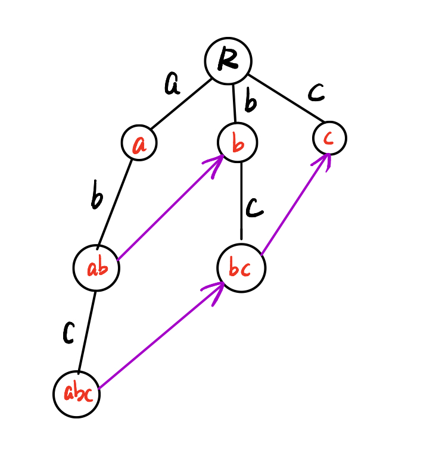
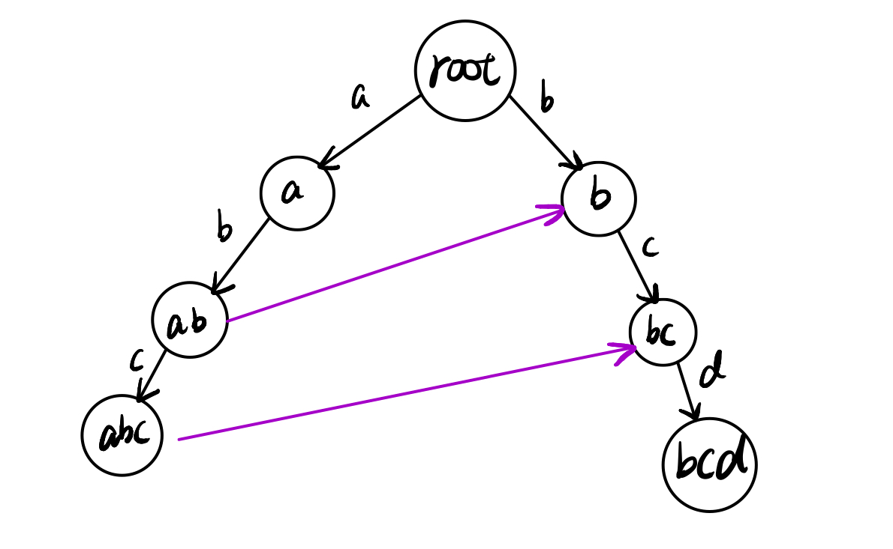

# 计算机应用编程实验三：多模式字符串匹配 - AC自动机  

| 学号       | 姓名   |
| ---------- | ------ |
| 2020110636 | 王尚荣 |
| 2020110630 | 王宝江 |


## 1、实验内容

- 编程实现 AC 自动机，进行多模式字符串匹配，从大文本串中查找所有模式串出现的位置和次数
- 输入：GB2312编码
  - `pattern.txt`：包含约200万个模式串的词典文件
  - `string.txt`：数据量约 800 M 的查找文本串
- 输出：
  - `result.txt`：记录匹配到的模式串的出现次数和出现位置


## 2、主要数据结构和流程

### 2.1 构造 Trie 树

#### 2.1.1 节点数据结构

- `fail`：失配指针，指向当前节点匹配失败时应转移到的下一节点

- `outputList`：可输出字符串列表，跳转到当前节点时匹配成功的字符串

```c++
/**
 * AC自动机的节点结构
 */
class Node{
public:
    Node(int m = 4){
        this->m = m;
        children = new Node* [m];
        for(int i = 0; i < m; ++i) {
            children[i] = nullptr;
        }
        fail = nullptr;
    }
    ~Node(){
        for(int i = 0; i < m; ++i)
            delete children[i];
        delete [] children;
    }
    int m;                      // 分叉数
    Node** children;			// 指向子节点的指针
    Node* fail;					// 失配指针
    List<char*> outputList;     // 当前节点的输出列表
};
```

#### 2.1.2 Trie 树的构造

- 在这里采用了m叉`Trie`树，m 设为 $2^n$，n 为一个节点代表的比特长度。
- 每当一个模式串插入后，将该模式串保存到最后 n 个比特所在节点的`outputList`中，便于对匹配成功的模式串进行输出。

```c++
/**
 * 插入模式串
 * @param pattern 模式串
 */
void AC_automachine::Insert(char *pattern) {
    if(pattern == nullptr)
        return;
    Node* p = root;
    int patternBitLen = strlen(pattern) * 8;
    int nodeBitLen = getNodeBitSize();
    for(int bitPos = 0; bitPos < patternBitLen; bitPos += nodeBitLen) {
        int nodeIdx = getNodeIdx(pattern, bitPos, nodeBitLen);
        if(p->children[nodeIdx] == nullptr) {
            p->children[nodeIdx] = new Node(m);
        }
        p = p->children[nodeIdx];
    }

    p->outputList.append(pattern);
    stats.append(new Stat(pattern));
    key2index.insert({pattern, stats.size() - 1 });
}
```

### 2.2 构造失配指针

#### 2.2.1 失配指针

- 节点的失配指针指向的是**以当前节点表示的字符为最后一个字符**的**最长当前字符串的后缀字符串的最后一个节点，**即，**当前节点表示字符串的最长后缀所在的节点**（这里的后缀不包括当前字符串）



- 如上图示例，紫色箭头表示节点的`fail`指针指向（指向`root`的箭头不标出）

- 对于abc节点，其表示的字符串为`abc`，后缀为`bc` 和`c`，其他模式串中匹配的最大后缀为`bc` ，因此abc节点的`fail`指针应指向`bc`节点，同理，`bc`节点的`fail`指针应指向`c`节点，`ab`节点的`fail`指针应指向`b`节点。

- 其他节点的后缀没有符合匹配的，因此`fail`指针指向`root`节点。

#### 2.2.2 失配指针的构造

- 思想：层序遍历，基于`bfs`逐个构造节点的`fail`指针
- 首先，`root`的`fail`域为`nullptr`， `root`的所有直接子节点（深度为1的子节点）的`fail`指针均指向`root`，因为这些节点的后缀只有自己。
- 对第n层的节点S，假设其父节点为P，S为P的第i个孩子（`P->child[i] = S`），由于已经构造完前n-1层的所有节点的`fail`指针了，因此可以获得S的父节点的`fail`节点M（`P->fail = M`）：
  - 若M的第i个子节点存在，假设是`Mi`，即`M->child[i] = Mi`，那么将S的`fail`指针指向`Mi`，即 `S->fail = Mi`
  - 若M的第i个子节点不存在，即`M->child[i] = NULL`,那么令P为P的`fail`域（`P = P->fail`），重新执行上述步骤，直到P为`nullptr`时，将S的`fail`指针指向`root`

- 构造方式通过队列实现，首先将根节点入队。从队列中取出队列首节点，遍历其所有子节点，执行上述步骤，计算出子节点的`fail`指针后加入队列，直到所有节点的`fail`指针都被构造完成。

```c++
/**
 * 构造fail指针域
 */
void AC_automachine::Build() {
    queue q;
    Node* p;
    Node* temp;
    q.push_back(root);          // root节点入队
    while (!q.isEmpty()){
        temp = q.pop_front();   // 取出队列首元素
        for(int i = 0; i < m; i++){
            if(temp->children[i]){
                if(temp == root){
                    // 根节点的所有子节点fail域为root
                    temp->children[i]->fail = root;
                }else{
                    p = temp->fail;
                    while (p){
                        // 若父节点的fail节点存在child[i] ，
                        // 则子节点的fail域指向父节点fail节点的子节点
                        if(p->children[i]){
                            temp->children[i]->fail = p->children[i];
                            break;
                        }
                        // 否则继续向上跳转
                        p = p->fail;
                    }
                    // 最终根节点的fail为nullptr ，则设置子节点的fail为root
                    if(p == nullptr)
                        temp->children[i]->fail = root;
                }
                // 构造fail结束后将child[i]入队
                q.push_back(temp->children[i]);
            }
        }
    }
    printf("patterns:%d\n", stats.size());
}
```

### 2.3 查询

#### 2.3.1  匹配并输出匹配到的模式串及其位置的思路

- AC自动机的匹配过程，其实就是P指针从`root`节点开始，在带有`fail`指针域的`Trie`树上不断跳转的过程，每当P跳转到一个节点N，则查看一下N的`outputList`，N的`outputList`存储的就是当前匹配到的模式串，同时，以N节点表示的字符串的所有后缀相应的也被匹配到（例如，N表示的字符串为`abc`，那么`abc`被匹配到，同时`bc`、`c`也会被匹配到，都应该被输出），因此需要通过`fail`指针不断向上跳转直到`root`节点，将沿途中经过的节点的`outputList`输出（**`fail`指针表示的意义就是当前串的最长后缀串，所以通过`fail`指针能够查出所有的后缀串**）。

- 结合简单的例子看一下匹配并输出的过程：

  文本串：`abcdbcd`

  模式串：`a、ab、abc、b、bc、bcd`

  首先构造好的Trie树和`fail`域（指向`root`的`fail`指针省略）

  

  匹配过程中P的跳转路径如下：

  `abcdbcd`

  - P从root开始跳转：
  - 扫描a，到达`a`节点，**输出a**
  - 扫描b，到达`ab`节点，**输出ab**，并沿着`fail`指针向上直到root，沿途**输出b**
  - 扫描c，到达`abc`节点，**输出abc**，并沿着`fail`指针向上直到root，沿途**输出bc**
  - 扫描d，失配跳转到`bc`节点，bc节点存在为d的子节点，因此跳转到bcd节点，**输出bcd**，由于bcd的`fail`指针直接指向root，因此没有输出
  - 扫描b，失配，沿着`fail`指针回到root，root节点存在为b的子节点，因此P跳转到`b`节点,**输出b**
  - 扫描c，到达`bc`节点，**输出bc**
  - 扫描d，到达`bcd`节点，**输出bcd**

  因此整个匹配过程，输出结果为：`a、ab、b、abc、bc、bcd、b、bc、bcd`，各模式串出现的次数为：

  `a：1`

  `ab：1`

  `abc：1`

  `b：2`

  `bc：2`

  `bcd：2`

  简而言之，每当P跳转到一个节点，都需要输出当前节点表示的字符串以及沿着当前节点的`fail`指针直到`root`的路径中所包含节点表示的字符串（**当一个字符串被成功匹配时，它的后缀也将被匹配**）

#### 2.3.2 查询的代码实现

```c++
/**
 * 匹配
 * @param text  长文本串
 * @param base  偏移量
 * @param start 起始状态节点，若为nullptr，从root开始
 * @return      匹配之后的状态
 */
Node* AC_automachine::Match(char *text, unsigned int base, Node* start) {
    Node* p = (start == nullptr ? root : start);
    int textBitLen = strlen(text) * 8;
    int nodeBitLen = getNodeBitSize();
    for(int bitPos = 0; bitPos < textBitLen; bitPos += nodeBitLen) {
        // 先查找是否存在child[index],不存在则跳转至fail
        int nodeIdx = getNodeIdx(text, bitPos, nodeBitLen);
        while (p->children[nodeIdx] == nullptr && p != root)
            p = p->fail;

        p = p->children[nodeIdx];
        if(p == nullptr)
            p = root;
        Node* tmp = p;
        while(tmp != root){
            if(!tmp->outputList.isEmpty()){
                for(int i = 0; i < tmp->outputList.size(); i++){
                    int pos = findKey(tmp->outputList[i]);
                    stats[pos]->count++;
                    if(stats[pos]->offsetList.size() < 3)
                        stats[pos]->offsetList.append((base + bitPos) / 8 - strlen(tmp->outputList[i]) + 1);
                }
            }
            tmp = tmp->fail;
        }
    }
    return p;
}
```

在这里没有直接将字符串输出，而是将其加入到stats中，stats用来保存模式串的信息，结构体如下：

```c++
/**
 *  统计信息
 *  存储 key count offset1, offset2 ...
 *  存储key的源
 */
class Stat{
public:
    Stat(char* k = nullptr) {
        key = k;
        count = 0;
    }
    char* key;
    unsigned count;
    List<unsigned int> offsetList;
};
```

由于文本串太大，一次性读取到内存中占用很多内存并且不太现实，因此选择每次最多读取2048字节到缓冲区中，然后进行匹配，并保存匹配完的节点（下次匹配将从这个节点开始匹配）

匹配的代码如下：

```c++
/**
 * 通过文本文件匹配
 * @param filename 文件名，带后缀
 * @param mode     打开模式
 */
void AC_automachine::MatchByFile(char *filename, char *mode) {
    FILE *infile = fopen(filename, mode);
    if(infile == nullptr){
        printf("Failed to open %s\n", filename);
        return;
    }
    unsigned int base = 0;
    char buff[2048 + 1];
    Node* start = root;
    int idx = 0;
    while(!feof(infile)) {
        int ch = fgetc(infile);     //读取一个字符
        idx = 0;
        //从文件中读取字符到缓冲区
        while(ch != 0x0A && ch != -1) {
            buff[idx] = ch;
            ++idx;
            if(idx == 2048)
                break;
            ch = fgetc(infile);
        }
        buff[idx] = '\0';           //一次读取完成
        start = Match(buff, base, start);
        base += idx * 8;
    }
    fclose(infile);
}
```


## 3、实验过程

- 从 `pattern.txt` 读取模式串
- 构造AC自动机
- 读取 `string.txt`
- 匹配，输出结果到 `result.txt`


## 4、遇到的问题

无


## 5、结果指标

| m（分叉数） | 内存峰值（MB） | 运行时间（ms） |
| ----------- | -------------- | -------------- |
| 2           | 9782           |                |
| 4           | 5500           | 732356         |
| 8           | 2289           | 347716         |
| 16          | 2249           | 309416         |
| 32          | 4450           | 198523         |
| 64          | 5434           | 185041         |
| 128         | 7623           | 145779         |
| 256         | 11397          | 211772         |


## 6、实验分工

| 成员              | 分工              |
| ----------------- | ----------------- |
| 王尚荣 2020110636 | AC自动机主体实现  |
| 王宝江 2020110630 | m叉Trie树的加入等 |


## 7、结论和总结

- AC自动机算法使用有限自动机的思想，将字符串比较转化为状态转移
- AC自动机算法结合了 Trie 树和 KMP 算法
- AC自动机算法有两个特点：
  - 扫描文本时完全不需要回溯
  - 时间复杂度为 O(n)，与关键字的数目和长度无关
- 实验结果表明，当节点叉数 m = 16 时，内存峰值最低