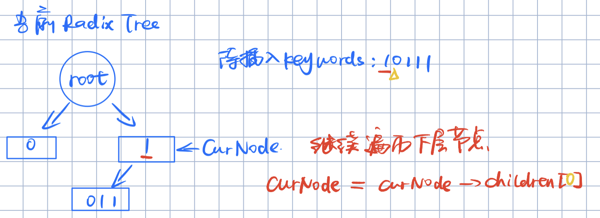

# 计算机应用编程实验二：树结构字符串检索

2020110636 王尚荣	2020110630 王宝江

## 1、实验内容

- 分别编程实现以下 4 种树形结构，以大规模字符串查找：
  - m阶B+树
  - 原始256叉Trie树
  - m叉查找树（mTrie）
  - Radix Tree（2叉压缩树）
- 输入：
  - `dict.txt`：包含127万个字符串的字典文件，需存储到树形结构
  - `string.txt`：包含1.7万个待匹配的字符串，通过树形结构进行查找
- 输出：
  - `result.txt`：记录匹配到的字符串


## 2、主要数据结构和流程

### 2.1 m阶B+树

#### 2.1.1 主要数据结构

- m阶B+树节点类

```c++
class TreeNode{
public:
    TreeNode(int m);
    ~TreeNode();
    int keyNums;        // 当前key个数
    char **Keys;        // 存储key值
    TreeNode **child;   // 存储子节点
    TreeNode *next;     // 当且节点为叶子节点时有用
private:
    int M;
};BplusTree
```

- m阶B+树类

```c++
class BplusTree {
public:
    BplusTree(int m);
    void Insert(char* key);
    bool Find(char* key);
    void FormatPrint();
    ~BplusTree();
private:
    TreeNode* Recursive_Insert(TreeNode* T, char* key, int i, TreeNode* parent);
    TreeNode* InsertElement(bool isKey, TreeNode* parent, TreeNode* T, char* key, int i, int j);
    TreeNode* SplitNode(TreeNode* parent, TreeNode* T, int i);
    TreeNode* FindSibling(TreeNode* parent, int i) const;
    TreeNode* MoveElement(TreeNode* Src, TreeNode* Dst, TreeNode* parent, int i, int n);
    TreeNode* RemoveElement(bool isKey, TreeNode* parent, TreeNode* T, int i, int j);
    TreeNode* FindMostRight(TreeNode* T);
    TreeNode* FindMostLeft(TreeNode* T);
    bool FindByNode(TreeNode* node, char* key);
    TreeNode* root;
    int M;
}
```


#### 2.1.2 流程

##### 插入

```C++
/**
 * 插入
 * @param key 待插入的key
 */
void BplusTree::Insert(char* key) {
    char *key_copy = new char[strlen(key)];
    strcpy(key_copy, key);
    root = Recursive_Insert(root, key_copy, 0, nullptr);
}

/**
 * 递归插入key
 * @param T 插入的节点
 * @param key 插入的值
 * @param i 当前节点是其父节点的第i叉
 * @param parent 节点T的父节点
 */
TreeNode* BplusTree::Recursive_Insert(TreeNode* T, char* key, int i, TreeNode* parent) {
    int j = 0;
    while(j < T->keyNums && strcmp(key, T->Keys[j]) >= 0){
        if(strcmp(key, T->Keys[j]) == 0)
            return T;         //有重复的值，则无需插入
        j++;
    }
    if( j != 0 && T->child[0] != nullptr)
        j--;
    if(T->child[0] == nullptr){
        // T 是叶子节点
        T = InsertElement(true, parent, T, key, i, j);
    }else{
        // T 是索引节点
        T->child[j] = Recursive_Insert(T->child[j], key, j, T);
    }
    //调整节点
    int Limit = M;
    TreeNode* Sibling = nullptr;
    if(T->keyNums > Limit){
        if(parent == nullptr){
            // T 为根节点的情况
            T = SplitNode(parent, T, i);
        }else{
            Sibling = FindSibling(parent, i);
            if(Sibling){
                // 存在有多余key空间的兄弟节点,将多出的一个元素移动过去
                MoveElement(T, Sibling, parent, i, 1);
            }else{
                // 兄弟节点没有空余key空间,分裂节点
                T = SplitNode(parent, T, i);
            }
        }

    }
    // 当有父节点时，更新父节点i处key的值
    if(parent){
        parent->Keys[i] = T->Keys[0];
    }
    return T;
}

/**
 * 对节点插入一个元素（key 或 node）：
 *                  对父节点插入T节点
 *                  对T节点插入key值
 * @param isKey     插入的是值还是节点
 * @param parent    T节点的父节点
 * @param T         插入的节点
 * @param key       插入的值
 * @param i         对T节点插入值key时，i为T在parent的位置,j为key要插入的位置
 * @param j         对parent节点插入T节点时，i为待插入的位置。j、key无用
 * @return          返回插入的节点或插入key的节点
 */
TreeNode *BplusTree::InsertElement(bool isKey, TreeNode* parent, TreeNode* T, char* key, int i, int j) {
    int k;
    if(isKey){
        //  将key插入到T节点处
        k = T->keyNums - 1;
        //一趟插入排序
        while(k >= j){
            T->Keys[k + 1] = T->Keys[k];
            k-- ;
        }
        // 插入 key
        T->Keys[j] = key;
        if(parent){
            //必要时更新父节点key
            parent->Keys[i] = T->Keys[0];
        }
        T->keyNums++;
    } else{
        // 将节点T插入到parent中
        if(T->child[0] == nullptr){
            // 若T为叶子节点， 则需要重新连接叶子节点
            if(i > 0)
                parent->child[i - 1]->next = T;
            T->next = parent->child[i];
        }
        k = parent->keyNums - 1;
        while (k >= i){
            // 需要同时更新孩子节点和key列表
            parent->child[k + 1] = parent->child[k];
            parent->Keys[k + 1] = parent->Keys[k];
            k--;
        }
        parent->child[i] = T;
        parent->Keys[i] = T->Keys[0];
        parent->keyNums++;
    }

    return T;
}

/**
 * 分裂节点
 * @param parent    T节点的父节点
 * @param T         待分裂的节点
 * @param i         该节点在父节点的位置
 * @return          返回插入后的节点（若创建新根则返回新的根节点）
 */
TreeNode *BplusTree::SplitNode(TreeNode* parent, TreeNode* T, int i) {
    int j,k,Limit;
    TreeNode* newNode = new TreeNode(M);
    k = 0;
    j = T->keyNums / 2;
    Limit = T->keyNums;
    //将有半部分复制到新节点中
    while (j < Limit){
        if(T->child[0] != nullptr){
            //针对索引节点，复制其子节点指针
            newNode->child[k] = T->child[j];
            T->child[j] = nullptr;
        }
        newNode->Keys[k] = T->Keys[j];
        T->Keys[j] = nullptr;
        newNode->keyNums++ ;
        T->keyNums--;
        k++;
        j++;
    }
    if(parent != nullptr){
        //将新节点插入到父节点中，位置是i+1 (当前节点的位置为i)
        InsertElement(false, parent, newNode, nullptr, i + 1, 0);
    }else{
        //当前节点T为根节点，分裂之后则需要创建新的根节点
        parent = new TreeNode(M);
        //将两节点插入到根节点中的0，1位置上去
        InsertElement(false, parent, T, nullptr, 0, 0);
        InsertElement(false, parent, newNode, nullptr, 1, 0);
        return parent;
    }
    return T;
}

/**
 * 查找兄弟节点，其存储的key未满，否则返回nullptr
 * @param parent 父节点
 * @param i      当前节点在父节点的位置
 * @return       有多余key空间的兄弟节点或nullptr
 */
TreeNode *BplusTree::FindSibling(TreeNode *parent, int i) const {
    TreeNode* Sibling = nullptr;
    int Limit = M;
    if(i == 0){
        if(parent->child[1]->keyNums < Limit)
            Sibling = parent->child[1];
    } else if(parent->child[i - 1]->keyNums < Limit)
        Sibling = parent->child[i - 1];
    else if(i+1 < parent->keyNums && parent->child[i + 1]->keyNums < Limit)
        Sibling = parent->child[i + 1];
    return Sibling;
}

/**
 * 移动元素， Src和Dst为相邻节点
 * @param Src       源节点
 * @param Dst       目的节点
 * @param parent    父节点
 * @param i         Src在父节点中的位置
 * @param n         移动元素的个数
 * @return          父节点
 */
TreeNode *BplusTree::MoveElement(TreeNode *Src, TreeNode *Dst, TreeNode *parent, int i, int n) {
    char* tempKey;
    TreeNode* child;
    int j = 0;
    bool isSrcFirst = false;        //是否Src节点在前面
    if(strcmp(Src->Keys[0], Dst->Keys[0]) < 0)
        isSrcFirst = true;

    if(isSrcFirst){
        // 节点Src 在 Dst前
        if(Src->child[0]){
            //Src 为索引节点
            while(j < n){
                child = Src->child[Src->keyNums - 1];
                RemoveElement(false, Src, child, Src->keyNums - 1, 0);
                // 由于Src 在 Dst前面， 因此Src的子节点移动到Dst时需要插入到最前面，即 i = 0
                InsertElement(false, Dst, child, nullptr, 0, 0);
                j++;
            }
        }else{
            //Src 为叶子节点
            while(j < n){
                tempKey = Src->Keys[Src->keyNums - 1];
                RemoveElement(true, parent, Src, i, Src->keyNums - 1);
                // Src 在 parent中的位置是i Dst 在 parent中的位置是 i + 1
                InsertElement(true, parent, Dst, tempKey, i + 1, 0);
                j++;
            }
        }
        //更新父节点的Keys
        parent->Keys[i + 1] = Dst->Keys[0];
        //更新Src 和 Dst下的叶子节点的连接
        if(Src->keyNums > 0)
            FindMostRight(Src)->next = FindMostLeft(Dst);

    }else{
        // 节点Src 在 Dst 后
        if(Src->child[0]){
            //Src 为索引节点
            while(j < n){
                child = Src->child[0];
                RemoveElement(false, Src, child, 0, 0);
                // Src 在 Dst后面，因此需要将Src的最左边的孩子移动到Dst最右边，即 i = Dst->keyNums
                InsertElement(false, Dst, child, nullptr, Dst->keyNums, 0);
                j++;
            }
        }else{
            // Src 为叶子节点
            while (j < n){
                tempKey = Src->Keys[0];
                RemoveElement(true, parent, Src, i, 0);
                InsertElement(true, parent, Dst, tempKey, i - 1, Dst->keyNums);
                j++;
            }
        }
        // 更新父节点i的值
        parent->Keys[i] = Src->Keys[0];c
        //更新Src 和 Dst下的叶子节点的连接
        if(Src->keyNums > 0)
            FindMostRight(Dst)->next = FindMostLeft(Src);

    }
    return parent;
}

/**
 * 移除节点中的一个元素（key 或 node）:
 *                  移除parent下的T节点
 *                  移除T节点中的key
 * @param isKey     移除的是否为key
 * @param parent    节点T的父节点
 * @param T         节点T
 * @param i         节点T在父节点中的位置
 * @param j         key在节点T中的位置
 * @return          移除key后的节点或移除的节点
 */
TreeNode *BplusTree::RemoveElement(bool isKey, TreeNode *parent, TreeNode *T, int i, int j) {
    int k, Limit;
    if(isKey){
        // 从节点T移除key, key在T的j位置
        Limit = T->keyNums;
        k = j + 1;
        while(k < Limit){
            T->Keys[k - 1] = T->Keys[k];
            k++;
        }
        T->Keys[Limit - 1] = nullptr;
        parent->Keys[i] = T->Keys[0];
        T->keyNums--;
    }else{
        // 将T节点从parent中删除
        if(T->child[0] == nullptr && i > 0){
            // 当T为叶子节点并且不在最左边,修改叶子节点的连接
            parent->child[i-1]->next = parent->child[i + 1];
        }
        Limit = parent->keyNums;
        k = i + 1;
        while(k < Limit){
            parent->Keys[k - 1] = parent->Keys[k];
            parent->child[k - 1] = parent->child[k];
            k++;
        }
        parent->child[Limit - 1] = nullptr;
        parent->Keys[Limit - 1] = nullptr;
        parent->keyNums--;
    }
    return T;
}
/*
 * 查找T节点所在树枝中最左边的叶子节点
 * @param T     叶子节点或索引节点
 * @return      最左边的叶子节点
 */
TreeNode *BplusTree::FindMostLeft(TreeNode *T) {
    TreeNode* tmp = T;
    while(tmp && tmp->child[0]){
        tmp = tmp->child[0];
    }
    return tmp;
}
```


##### 查找

```c++
/**
 * 查找key
 * @param key   待查找的key
 * @return      是否找到
 */
bool BplusTree::Find(char* key) {
    return FindByNode(root, key);
}

bool BplusTree::FindByNode(TreeNode *node, char* key) {
    if(node == nullptr)
        return false;
    if(node->child[0]){
        // node为索引节点
        int i = 0;
        while(i < node->keyNums && strcmp(key, node->Keys[i]) >= 0){
            if(strcmp(key, node->Keys[i]) == 0)
                return true;
            i++;
        }
        if(i > 0)
            i--;
        return FindByNode(node->child[i], key);
    }else{
        // node为叶子节点
        for(int i = 0; i < node->keyNums; i++)
            if(strcmp(node->Keys[i], key) == 0)
                return true;
        return false;
    }
}
```


### 2.2 原始256叉Trie树

#### 2.2.1 主要数据结构

- Trie 树节点类

```c++
/**
 * Trie树节点结构
 */
class TrieNode{
public:
    TrieNode(char v, bool isWord= false){
        memset(child, NULL, sizeof(child)/sizeof(TrieNode*));
        this->isWord = isWord;
        val = v;
    }
    ~TrieNode(){
        for(int i = 0; i < sizeof(child)/sizeof(TrieNode*); i++)
            delete child[i];
    }
    TrieNode* child[256];
    bool isWord;        // 是否为根节点
    char val;           // 记录当前节点表示的值
};
```

- Trie 树类

```c++
/**
 * Trie树结构
 */
class Trie {
public:
    Trie() {
        root = new TrieNode('\0', false);
    }
    void Insert(char* key);
    bool Find(char* key);
    void FormatPrint();
    ~Trie(){
        delete root;
    }
private:
    TrieNode* root;
private:
    bool Search(TrieNode* node, char* key, int pos);
};
```


#### 2.2.2 流程

##### 插入

```c++
/**
 * 插入key
 * @param key 待插入的字符串
 */
void Trie::Insert(char *key) {
    if(key == nullptr || strlen(key) == 0)
        return;
    TrieNode* cur = root;
    int len = strlen(key);
    // 迭代将每个字符插入到child域中
    for(int i = 0; i < len; i++){
        int index = key[i] + 128;
        if(!cur->child[index])
            cur->child[index] = new TrieNode(key[i]);
        cur = cur->child[index];
    }
    cur->isWord = true;
}
```


##### 查找

```c++
bool Trie::Find(char *key) {
    return Search(root, key, 0);
}
/**
 * 在节点中查找从key[index:]是否存在
 * @param node      开始节点
 * @param key       查找的字符串
 * @param pos       从key[pos]开始查找
 * @return          是否存在;
 */
bool Trie::Search(TrieNode *node, char *key, int pos) {
    if(strlen(key) == 0)
        return false;
    int index = key[pos] + 128;
    TrieNode* cur = node->child[index];
    if(!cur)
        return false;
    if(pos == strlen(key) - 1)
        return cur->isWord;
    return Search(cur, key, pos + 1);
}
```


### 2.3 m叉查找树

#### 2.3.1 主要数据结构

- mTrie 的节点类

```C++
class MTrieNode
{
public:
    int m;                  //叉数，节点的分支数、子节点数
    bool isWord;            //是否代表一个词（叶节点）
    MTrieNode **children;   //指向子节点的指针

    MTrieNode(int m, bool isWord = false);
    ~MTrieNode();
};

MTrieNode::MTrieNode(int m, bool isWord = false)
{
    this->m = m;
    this->isWord = isWord;

    children = new MTrieNode *[m];
    for(int i = 0; i < m; ++i)
    {
        children[i] = nullptr;
    }
}

MTrieNode::~MTrieNode()
{
    for(int i = 0; i < m; ++i)
    {
        delete children[i];
    }
    delete []children;
}
```

**注**：m 代表节点叉树，即子节点数。

$m = 2^n$ ，n 代表一个节点表示的比特串长度。

但是节点本身并不设置字段来存储比特串，而是通过节点序号（它是父节点的第几个子节点）代表该节点存储的比特串的值，eg. 设 m = 4, 即 n = 2，若一个节点是其父节点的第 3 个子节点，则其代表的比特串为 11。

- mTrie 类

```c++
class MTrie
{
public:
    MTrieNode* root;        //根节点
    int m;                  //叉数

    MTrie(int m);
    ~MTrie();
    int getBitSize();       //获取每个节点代表的比特位数 n，2^n = m
    void Insert(char *key); //插入一个词
    bool Find(char *key);   //查找一个词
    int getNodeIdx(char *key, int curKeyBitPos, int nodeBitSize);   //获取关键词 key 在 curKeyBitPos 开始的 n(nodeBitSize) 位，对应的节点序号(即n bits二进制对应的数值)
};

MTrie::MTrie(int m)
{
    this->m = m;
    root = new MTrieNode(m, false);
}

MTrie::~MTrie()
{
    delete root;
}

//获取每个节点代表的比特位数 n，2^n = m
int MTrie::getBitSize()
{
    return int(log(m) / log(2));
}
```


#### 2.3.2 流程

一个节点代表的字符串长度 n = $log_2 m$

##### 插入

- 读入一个 keyword
- 初始：`cur` 指向 mTrie 的根节点，`bitPos` = 0 表示遍历到 keyword 的第一个比特
- 循环：按比特遍历 keyword，直到遍历完所有比特
  - 根据 keyword 从 `bitPos` 开始的 n 个比特，得到对应的子节点序号 `nodeIdx` （eg. 若 n 个比特为 11，则子节点序号为 3）
  - 访问 `cur` 节点的第 `nodeIdx` 个子节点，如果该子节点为空（指针为 `nullptr`），则新建(`new`)该子节点
  - `cur = cur->children[nodeIdx]`，cur 节点指向第 `nodeIdx` 个子节点，继续循环
- 最后将 `cur->isWord` 设置为 `true`，该节点表示 keyword

代码实现如下：

```C++
void MTrie::Insert(char *key)
{
    if(key == nullptr || strlen(key) == 0)
        return;

    MTrieNode *cur = root;
    int keyByteSize = strlen(key);
    int nodeBitSize = getBitSize();
    for(int bitPos = 0; bitPos < keyByteSize * 8; bitPos += nodeBitSize)
    {
        int nodeIdx = getNodeIdx(key, bitPos, nodeBitSize);

        if(cur->children[nodeIdx] == nullptr)
        {
            cur->children[nodeIdx] = new MTrieNode(m, false);
        }
        cur = cur->children[nodeIdx];
    }
    cur->isWord = true;
}
```


##### 查找

- 读入一个 keyword
- 初始：`cur` 指向 mTrie 的根节点，`bitPos` = 0 表示遍历到 keyword 的第一个比特
- 循环：按比特遍历 keyword，直到遍历完所有比特
  - 根据 keyword 从 `bitPos` 开始的 n 个比特，得到对应的子节点序号 `nodeIdx` （eg. 若 n 个比特为 11，则子节点序号为 3）
  - 访问 `cur` 节点的第 `nodeIdx` 个子节点
    - 如果该子节点为空（指针为 `nullptr`），则代表 keyword 不存在，查询失败，退出循环
    - 如果该子节点不为空，则将 `cur` 节点指向第 `nodeIdx` 个子节点，继续循环
- 遍历结束 keyword 的所有比特，返回 `cur->isWord` ， `curNode->isWord == ture` 代表 keyword 存在，查找成功； `curNode->isWord == false` 代表 keyword 不存在，查找失败

代码实现如下：

```c++
//查找一个词
bool MTrie::Find(char *key)
{
    if(key == nullptr || strlen(key) == 0)
        return false;

    MTrieNode *cur = root;
    int keyByteSize = strlen(key);
    int nodeBitSize = getBitSize();
    for(int bitPos = 0; bitPos < keyByteSize * 8; bitPos += nodeBitSize)
    {
        int nodeIdx = getNodeIdx(key, bitPos, nodeBitSize);
        if(cur->children[nodeIdx] == nullptr)
        {
            return false;
        }
        else
        {
            cur = cur->children[nodeIdx];
        }
    }

    return cur->isWord;
}
```


##### 比特操作

```C++
//根据关键词 key 在 curKeyBitPos 开始的 n(nodeBitSize) 位bit，返回对应的节点序号(即 n bits二进制对应的数值，eg. 若 n 个比特为 11，则子节点序号为 3)
int MTrie::getNodeIdx(char *key, int curKeyBitPos, int nodeBitSize)
{
    int keyByteSize = strlen(key);
    int startKeyByte = curKeyBitPos / 8;
    int startBitPos = curKeyBitPos % 8;

    int endKeyByte = (curKeyBitPos + nodeBitSize - 1) / 8;
    int endBitPos = (curKeyBitPos + nodeBitSize - 1) % 8;
    endBitPos = endKeyByte >= keyByteSize ? 7 : endBitPos;
    endKeyByte = endKeyByte >= keyByteSize ? keyByteSize - 1 : endKeyByte;

    int nodeIdx = 0;
    for(int i = startKeyByte; i <= endKeyByte; ++i)
    {
        int start = i == startKeyByte ? startBitPos : 0;
        int end = i == endKeyByte ? endBitPos : 7;
        for(int j = start; j <= end; ++j)
        {
            int bitNum = (key[i] >> (8 - j - 1)) & 1;
            nodeIdx = nodeIdx * 2 + bitNum;
        }
    }
    return nodeIdx;
}
```


### 2.4 Radix Tree

#### 2.4.1 主要数据结构

- Radix Tree 的节点类

```c++
class RadixNode
{
public:
    unsigned char *value;       //指向节点代表的比特串
    int valBitLen;              //节点代表的比特串的bits长度
    bool isWord;                //是否代表一个词（叶节点）
    RadixNode *children[2];     //指向两个子节点的指针

    RadixNode();
    ~RadixNode();
};

RadixNode::RadixNode()
{
    value = nullptr;
    valBitLen = 0;
    isWord = false;
    children[0] = nullptr;
    children[1] = nullptr;
}

RadixNode::~RadixNode()
{
    if(value != nullptr)
    {
        delete []value;
        value = nullptr;
    }

    delete children[0];
    children[0] = nullptr;

    delete children[1];
    children[1] = nullptr;
}
```

**注**：因为是二叉压缩树，所以总是指定 `children[0]` 指向的子节点存储以 0 开始的比特串， `children[1]` 指向的子节点存储以 1 开始的比特串

- Radix Tree 类

```c++
class RadixTree
{
public:
    RadixNode *root;            //指向根节点的指针

    RadixTree();
    ~RadixTree();
    void Insert(char *key);     //将单词 key 插入Radix Tree
    bool Find(char *key);       //从 Radix Tree 种查找单词 key 是否存在
    void copyBits(unsigned char *&destVal, unsigned char *oriVal, int oriBitsStart, int oriBitsEnd);    //将 orival 指向数组的指定比特位拷贝赋值给 destval 指向的数组
    int getFirstBit(unsigned char *key, int curBitIdx);     //获取单词 key 的第 curBitIdx 个比特位
};

RadixTree::RadixTree()
{
    root = new RadixNode();
}

RadixTree::~RadixTree()
{
    delete root;
}
```

#### 2.4.2 流程

##### 插入

- 读入一个 keyword，该 keyword 的第一个 bit 值为 `firstKeyBit`（0或1）

- 初始：

  - 设定一个 `curNode` 指针，指向Radix Tree `root` 节点的第 `firstKeyBit` 个子节点，代表当前比较的节点
  - 设定 `keyBitIdx` = 0，代表当前遍历到 keyword 的第几个 bit 位

- LOOP1：循环遍历 keyword 的每一个 bit 

  - 如果 `curNode` 为空指针，即节点不存在，则新建一个节后缀节点，存储 keyword 从 `keyBitIdx` 开始的剩余比特串，`curNode `  指向该节点，`isWord` 设为 `true`，表示该节点代表一个单词（是叶节点）。插入结束，退出 LOOP1

    

  - 初始：设定 `nodeBitIdx` = 0，当表当前遍历到 `curNode` 存储的比特串的第几个 bit 位

  - LOOP2：循环，依次比较 keyword 和 当前节点存储的比特串的比特值

    - CASE1：若当前比较的比特值不同（ `curNode` 比特串的第 `nodeBitIdx` 个 bit 的值不等于 keyword 的第  `keyBitIdx` 个 bit 的值），退出 LOOP2
    - CASE2：若 keyword 的 bits 先遍历结束，但 `curNode` 的比特串未遍历结束，退出 LOOP2
    - CASE3：若 `curNode` 的比特串先遍历结束，而 keyword 的 bits 未遍历结束，退出 LOOP2
    - CASE4：若 keyword 和 `curNode` 的比特串同时遍历结束，退出 LOOP2

  - 若因为 CASE1 退出的 LOOP2

    - 生成一个公共前缀节点来存储公共前缀
    - 将 `curNode` 节点存储的比特串改为去掉公共前缀的剩余比特串
    - 生成一个后缀节点存储 keyword 去掉公共前缀的剩余比特串，该节点代表存储了 keyword 这个词串
    - 新生成节点的插入方式如下图所示
    - 插入结束，退出 LOOP1

    

  - 若因为 CASE2 退出的 LOOP2

    - 生成一个后缀节点，存储原 `CurNode` 节点的比特串去掉公共前缀后的比特串
    - 将原来 `CurNode` 节点存储的比特串改为公共前缀，该节点代表存储了 keyword 这个词串
    - 新生成节点的插入方式如下图所示
    - 插入结束，退出 LOOP1

    

  - 若因为 CASE3 退出的 LOOP2

    - 定义`curKeyBit` = keyword 的第`keyBitIdx` 个比特值
    - `curNode = curNode->children[curKeyBit]`，将 `curNode` 指向下层子节点，继续 LOOP1

    

  - 若因为 CASE4 退出的 LOOP2

    - 将 `curNode` 的 `isWord` 字段设为 `true`，表示 keyword 这个词串
    - 插入结束，退出 LOOP1

    

代码实现如下：

```C++
void RadixTree::Insert(char *key)
{
    if(key == nullptr || strlen(key) == 0)
        return;

    int keyBitsLen = strlen(key) * 8;   //key 的 bits 长度

    RadixNode *preNode = root;
    RadixNode *curNode;
    int keyBitIdx = 0;
    //获取关键词 key 当前遍历到的 bit 位，决定与 0 子树还是 1 子树比较
    int firstKeyBit = getFirstBit(reinterpret_cast<unsigned char*> (key), keyBitIdx);
    curNode = preNode->children[firstKeyBit];
    while(keyBitIdx < keyBitsLen)
    {
        firstKeyBit = getFirstBit(reinterpret_cast<unsigned char*> (key), keyBitIdx);

        if(curNode == nullptr)          //比较的节点为空，则新建节点，拷贝 key 剩余部分，遍历结束
        {
            curNode = new RadixNode();
            curNode->valBitLen = keyBitsLen - keyBitIdx;
            copyBits(curNode->value, reinterpret_cast<unsigned char*> (key), keyBitIdx, keyBitsLen);

            //插入完成，结束遍历
            //firstKeyBit = getFirstBit(reinterpret_cast<unsigned char*> (key), keyBitIdx);
            preNode->children[firstKeyBit] = curNode;
            keyBitIdx = keyBitsLen;
            curNode->isWord = true;
        }
        else                            //逐比特比较节点的值和key的值
        {
            int nodeBitIdx = 0;
            int curKeyBit = getFirstBit(reinterpret_cast<unsigned char*> (key), keyBitIdx);
            int curNodeBit = getFirstBit(curNode->value, nodeBitIdx);
            //逐比特比较节点的值和key的值
            while((nodeBitIdx < curNode->valBitLen) && (keyBitIdx < keyBitsLen) && (curKeyBit == curNodeBit))
            {
                ++keyBitIdx;
                ++nodeBitIdx;
                if(keyBitIdx < keyBitsLen)
                    curKeyBit = getFirstBit(reinterpret_cast<unsigned char*> (key), keyBitIdx);
                if(nodeBitIdx < curNode->valBitLen)
                    curNodeBit = getFirstBit(curNode->value, nodeBitIdx);
            }

            //因出现比较的bit值不同而退出循环的情况
            if(keyBitIdx < keyBitsLen && nodeBitIdx < curNode->valBitLen && curKeyBit != curNodeBit)
            {
                //生成一个前缀节点以存储公共前缀
                RadixNode *prefixNode = new RadixNode();
                prefixNode->valBitLen = nodeBitIdx;
                copyBits(prefixNode->value, curNode->value, 0, nodeBitIdx);

                //将 curNode 的value值去掉公共前缀
                unsigned char *remainVal = nullptr;
                copyBits(remainVal, curNode->value, nodeBitIdx, curNode->valBitLen);
                delete [](curNode->value);
                curNode->value = remainVal;
                curNode->valBitLen = curNode->valBitLen - nodeBitIdx;

                //生成新的子节点存储 keyword 的剩余(后缀)部分
                RadixNode *suffixNode = new RadixNode();
                suffixNode->valBitLen = keyBitsLen - keyBitIdx;
                copyBits(suffixNode->value, reinterpret_cast<unsigned char*> (key), keyBitIdx, keyBitsLen);
                suffixNode->isWord = true;      //该后缀节点代表 keyword 这个词

                //插入前缀节点
                preNode->children[firstKeyBit] = prefixNode;
                //preNode = prefixNode;
                prefixNode->children[curNodeBit] = curNode;

                //插入新生成的 keyword 后缀子节点
                prefixNode->children[curKeyBit] = suffixNode;

                //插入完成，结束遍历字符串的bits
                keyBitIdx = keyBitsLen;
            }

            //因 keyword 先遍历结束，但 curNode->value 未遍历完，而退出循环的情况
            else if(keyBitIdx >= keyBitsLen && nodeBitIdx < curNode->valBitLen)
            {
                //生成 curNode->value 的后缀的节点（去掉公共前缀，即去掉整个 keyword 的值），代表原本的 curNode 表示的的词
                RadixNode *suffixNode = new RadixNode();
                suffixNode->valBitLen = curNode->valBitLen - nodeBitIdx;
                copyBits(suffixNode->value, curNode->value, nodeBitIdx, curNode->valBitLen);
                suffixNode->isWord = true;

                //修改 curNode->value 值为公共前缀，即keyword，代表keyword这个词
                unsigned char *prefixVal = nullptr;
                copyBits(prefixVal, curNode->value, 0, nodeBitIdx);
                delete [](curNode->value);
                curNode->value = prefixVal;
                curNode->valBitLen = nodeBitIdx;

                //插入后缀节点
                //preNode = curNode;
                curNode->children[curNodeBit] = suffixNode;
                //curNode = curNode->children[curNodeBit];

                //插入完成，结束遍历字符串的bits
                //keyBitIdx = keyBitsLen;     //本身已成立，可不加
            }

            //keyword 和 curNode->value 的 bit 位同时遍历完 而退出循环的情况
            else if(keyBitIdx >= keyBitsLen && nodeBitIdx >= curNode->valBitLen)
            {
                curNode->isWord = true;
                //插入完成，结束遍历
                keyBitIdx = keyBitsLen;     //本身已成立，可不加
            }

            //因 curNode->value 的bits先遍历结束，但 keyword 未遍历完，而退出循环的情况
            else if(keyBitIdx < keyBitsLen && nodeBitIdx >= curNode->valBitLen)
            {
                preNode = curNode;
                curNode = curNode->children[curKeyBit];
                //keyBitIdx不变，定位到当前遍历到的位置
                //继续循环遍历，kyeword剩余部分与下一层节点进行比较
            }
        }
    }
}
```


##### 查找

- 读入一个 keyword，该 keyword 的第一个 bit 值为 `firstKeyBit`（0或1）
- 初始：
  - 设定一个 `curNode` 指针，指向Radix Tree `root` 节点的第 `firstKeyBit` 个子节点，代表当前比较的节点
  - 设定 `keyBitIdx` = 0，代表当前遍历到 keyword 的第几个 bit 位
- LOOP1：循环遍历 keyword 的每一个 bit 
  - 如果 `curNode` 为空指针，即节点不存在，则返回 false，结束 LOOP1，代表 keyword 不存在，查找失败
  - 初始：设定 `nodeBitIdx` = 0，当表当前遍历到 `curNode` 存储的比特串的第几个 bit 位
  - LOOP2：循环，依次比较 keyword 和 当前节点存储的比特串的比特值
    - CASE1：若当前比较的比特值不同（ `curNode` 比特串的第 `nodeBitIdx` 个 bit 的值不等于 keyword 的第  `keyBitIdx` 个 bit 的值），退出 LOOP2
    - CASE2：若 keyword 的 bits 先遍历结束，但 `curNode` 的比特串未遍历结束，退出 LOOP2
    - CASE3：若 `curNode` 的比特串先遍历结束，而 keyword 的 bits 未遍历结束，退出 LOOP2
    - CASE4：若 keyword 和 `curNode` 的比特串同时遍历结束，退出 LOOP2
  - 若因为 CASE1 退出的 LOOP2
    - 返回 false，结束 LOOP1，代表 keyword 不存在，查找失败
  - 若因为 CASE2 退出的 LOOP2
    - 返回 false，结束 LOOP1，代表 keyword 不存在，查找失败
  - 若因为 CASE3 退出的 LOOP2
    - 定义`curKeyBit` = keyword 的第`keyBitIdx` 个比特值
    - `curNode = curNode->children[curKeyBit]`，将 `curNode` 指向下层子节点，继续 LOOP1
  - 若因为 CASE4 退出的 LOOP2
    - 返回 `curNode->isWord`，结束LOOP1。 `curNode->isWord == ture` 代表 keyword 存在，查找成功； `curNode->isWord == false` 代表 keyword 不存在，查找失败

代码实现如下：

```C++
bool RadixTree::Find(char *key)
{
    if(key == nullptr || strlen(key) == 0)
        return false;

    int keyBitsLen = strlen(key) * 8;
    RadixNode * curNode;
    int keyBitIdx = 0;
    int firstKeyBit = getFirstBit(reinterpret_cast<unsigned char*>(key), keyBitIdx);
    curNode = root->children[firstKeyBit];
    while(keyBitIdx < keyBitsLen)
    {
        if(curNode == nullptr)
            return false;

        int nodeBitIdx = 0;
        int curKeyBit = getFirstBit(reinterpret_cast<unsigned char*> (key), keyBitIdx);
        int curNodeBit = getFirstBit(curNode->value, nodeBitIdx);
        //逐比特比较节点的值和key的值
        while((nodeBitIdx < curNode->valBitLen) && (keyBitIdx < keyBitsLen) && (curKeyBit == curNodeBit))
        {
            ++keyBitIdx;
            ++nodeBitIdx;
            if(keyBitIdx < keyBitsLen)
                curKeyBit = getFirstBit(reinterpret_cast<unsigned char*> (key), keyBitIdx);
            if(nodeBitIdx < curNode->valBitLen)
                curNodeBit = getFirstBit(curNode->value, nodeBitIdx);
        }

        //因出现比较的bit值不同而退出循环的情况
        if(keyBitIdx < keyBitsLen && nodeBitIdx < curNode->valBitLen && curKeyBit != curNodeBit)
            return false;

        //因 keyword 先遍历结束，但 curNode->value 未遍历完，而退出循环的情况
        else if(keyBitIdx >= keyBitsLen && nodeBitIdx < curNode->valBitLen)

            return false;

        //keyword 和 curNode->value 的 bit 位同时遍历完 而退出循环的情况
        else if(keyBitIdx >= keyBitsLen && nodeBitIdx >= curNode->valBitLen)
            return curNode->isWord;

        //因 curNode->value 的bits先遍历结束，但 keyword 未遍历完，而退出循环的情况
        else if(keyBitIdx < keyBitsLen && nodeBitIdx >= curNode->valBitLen)
            curNode = curNode->children[curKeyBit];
    }
}
```


##### 比特操作

```C++
//将 orival 字符串的第 oriBitsStart 至 第oriBitsEnd（不含） 个比特串拷贝赋值给 destVal
void RadixTree::copyBits(unsigned char *&destVal, unsigned char *oriVal, int oriBitsStart, int oriBitsEnd)
{
    if(destVal != nullptr && destVal != oriVal) //非空且不是自拷贝
    {
        delete []destVal;
    }
    int bitsLen = oriBitsEnd - oriBitsStart;
    int bytesLen = bitsLen / 8 + 1;
    destVal = new unsigned char[bytesLen];
    memset(destVal, 0, bytesLen);

    for(int i = 0; i < bitsLen; ++i)
    {
        //取 oriVal 的 1bit
        int oriBitNum = getFirstBit(oriVal, oriBitsStart + i);

        int destByteIdx = i / 8;
        int destByteBitIdx = i % 8;

        //将取出的 1bit 拷贝给 destVal
        if(oriBitNum == 0)
        {
            unsigned char maskBits = ~(1 << (8 - destByteBitIdx - 1));
            destVal[destByteIdx] = destVal[destByteIdx] & maskBits;
        }
        else if(oriBitNum == 1)
        {
            unsigned char maskBits = 1 << (8 - destByteBitIdx - 1);
            destVal[destByteIdx] = destVal[destByteIdx] | maskBits;
        }
    }
}

//返回 key 字符串第 curBitIdx 个比特位的值
int RadixTree::getFirstBit(unsigned char *key, int curBitIdx)    
{
    int ByteIdx = curBitIdx / 8;
    int ByteBitIdx = curBitIdx % 8;
    int bitNum = (key[ByteIdx] >> (8 - ByteBitIdx - 1)) & 1;

    return bitNum;
}
```


## 3、实验过程

### 3.1 m阶B+树

1. 创建 `BplusTree` 对象
2. 读取 `dict.txt` ，每读取一个 keyword，将其插入到  `BplusTree`
3. 读取 `string.txt` ，每读取一个 keyword，查找 `BplusTree`，如查找成功，将该 keyword 输出到 `result.txt` 。统计查找成功的 keywords 个数


### 3.2 原始256叉Trie树

1. 创建 `Trie` 对象
2. 读取 `dict.txt` ，每读取一个 keyword，将其插入到  `Trie`
3. 读取 `string.txt` ，每读取一个 keyword，查找 `Trie`，如查找成功，将该 keyword 输出到 `result.txt` 。统计查找成功的 keywords 个数


### 3.3 m叉查找树

1. 创建 `mTrie` 对象
2. 读取 `dict.txt` ，每读取一个 keyword，将其插入到 `mTrie`
3. 读取 `string.txt` ，每读取一个 keyword，查找  `mTrie` ，如查找成功，将该 keyword 输出到 `result.txt` 。统计查找成功的 keywords 个数


### 3.4 Radix Tree

1. 创建 `RadixTree` 对象（二叉压缩树）
2. 读取 `dict.txt` ，每读取一个 keyword，将其插入到 `RadixTree` 
3. 读取 `string.txt` ，每读取一个 keyword，查找  `RadixTree` ，如查找成功，将该 keyword 输出到 `result.txt` 。统计查找成功的 keywords 个数


## 4、遇到的问题

- 问题一：Radix Tree 代码运行时在 `delete []` 处崩溃

  解决：在 `new unsigned char[]` 之后，错误地用比特长度 `memset`，对于 

  `unsigned char[]` ，应该用字节长度 `memset`


## 5、结果指标

| 树形结构            | 参数设置   | 内存峰值(MB) | 运行时间(ms) |
| ------------------- | ---------- | ------------ | ------------ |
| m阶B+树             | m = 3      | 71           | 1455         |
| m阶B+树             | m = 5      | 39           | 1214         |
| m阶B+树             | m = 10     | 23           | 1220         |
| m阶B+树             | m = 15     | 24           | 1250         |
| m阶B+树             | m = 20     | 19           | 1339         |
| 原始256叉Trie树     |            | 8052         | 5502         |
| m叉查找树（Trie树） | m = 2      | 681          | 4690         |
| m叉查找树（Trie树） | m = 4      | 526          | 3041         |
| m叉查找树（Trie树） | m = 8      | 622          | 2563         |
| m叉查找树（Trie树） | m = 16     | 826          | 2388         |
| m叉查找树（Trie树） | m = 32     | 1409         | 2713         |
| m叉查找树（Trie树） | m = 64     | 2349         | 3135         |
| m叉查找树（Trie树） | m = 128    | 4173         | 4409         |
| m叉查找树（Trie树） | m = 256    | 8052         | 5502         |
| Radix Tree          | 二叉压缩树 | 96           | 2905         |


## 6、实验分工

| 成员              | 分工                        |
| ----------------- | --------------------------- |
| 王尚荣 2020110636 | m阶B+树、原始256叉Trie树    |
| 王宝江 2020110630 | m叉查找树（mtrie）、Radix树 |


## 7、结论和总结

### 7.1 m阶B+树

- 从结果指标能够发现，随着B+树的阶数（M）增大，内存峰值在不断减少，原因是M增大后，树的高度降低，整体节点数变少，因此内存占用变少，但同时时间开销先减少后增大，因为当M过大时，虽然查找的层数降低了，但是每层需要比较的次数变多了，当M很大的情况下，时间复杂度接近于O（N），当M取值合适时，查找复杂度为Log（M，N）


### 7.2 原始256叉Trie树

- Trie树的高度取决于字典中最长的单词长度，因此查找速度相对于二叉树会快很多，它是通过空间换时间的方式利用字符串的公共前缀来降低查询的时间开销。

- Trie树占用内存空间大
- 按字节读取字符串，一个字节 8 bits，一共有 $2^8 = 256$ 种比特串组合，因此按字节读取字符串时，Trie 树的叉数为 256


### 7.3 m叉查找树

- m叉查找树的 m 代表节点的分支数（即子节点数）
- $m = 2^n$ ，n 代表一个节点表示的比特串长度。插入和查找时，每次读取 n 位 bits 进行比较
- 一个节点表示 n 位长的比特串，但是节点本身并不存储比特串，而是通过节点序号代表比特串的值（eg. 设  n = 2，若一个节点是其父节点的第 3 个子节点，则其代表的比特串为 11）
- 叉数 m 取值不是任意的，为 $2^n$，否则一个节点代表的比特串长度就不是整数。m 也不能为 1，否则一个节点代表的比特串长度就为 0。因此实验中 m 取值 2，4，8，16，32，64，128，256
- 实验结果表明，在叉数为 4 时，内存占用最低，为 526MB，当叉数小于 4（叉数为 2）时，内存占用增加；当叉数大于 4 时（4~256），内存占用随着叉数的增加而增加


### 7.4 Radix Tree

- Radix Tree 是 Trie 树的一种演进，核心思想是压缩路径，节点代表的比特位长度不再是固定的，能有效降低树的高度，节省空间，提升查找效率
- 从实验结果对比可以看出，Radix Tree的内存占用明显低于 m 叉查找树（Trie树），内存占用峰值仅为 96 MB，而 m 叉查找树最低也需占用 526MB

