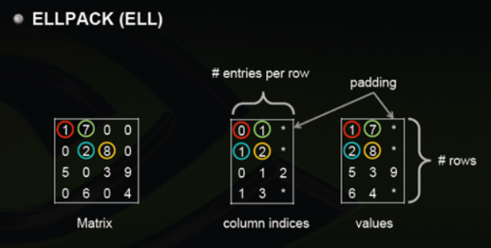
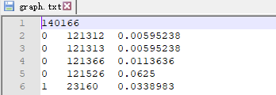
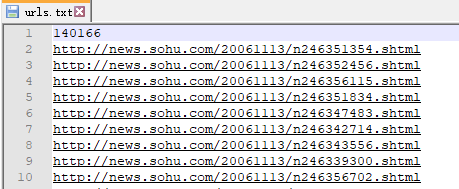
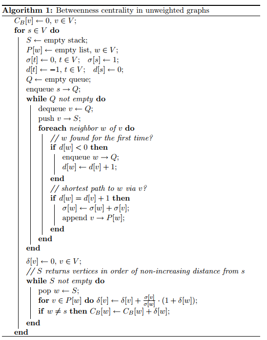

# 计算机应用编程实验四：网络VIP节点分析实验报告

| 学号       | 姓名   |
| ---------- | ------ |
| 2020110636 | 王尚荣 |
| 2020110630 | 王宝江 |


## 1、实验内容

设计一个图节点分析程序，将十几万个网页构建页面链接网络，计算前20个VIP页面。

分别实现三个任务：

- 构建矩阵图并存储
  - 遍历`webdir`下所有网页，构建稀疏矩阵结构的图，并持久化存储到文件`graph.bin`
- 使用`PageRank`度量指标，计算前20个VIP页面
  - 读取`graph.bin`并在`result.txt`输出`pagerank`最高的前20个文件
  - `result.txt`的第1行`pagerank`迭代次数，从2-21行每行一个文件名 空格 `pagerank`值
- 使用介数中心性度量指标，计算前20个VIP页面
  - 读取`graph.bin`并在`result.txt`输出介数值最高的前20个文件
  - `result.txt`的第每行输出一个文件名 空格 介数值


## 2、主要数据结构和流程

### 2.1 build graph

#### 2.1.1 网页URL提取

- 使用AC自动机提取网页中的有效URL（这里指的是在当前目录下的url是有效的，因为其他的链接如广告链接等没有相应的节点，将会导致排名泄露）
- 第一次递归查询webdir目录下所有shtml/html文件，通过访问的顺序给每个文件编号，作为其节点值（URL映射到图节点），并将其作为模式串插入构造AC自动机
- 第二次递归开始对webdir目录下每个shtml/html文件读取进行匹配，找到其链接出的所有有效URL（也就是之前插入的模式串），然后转换成图节点构造稀疏矩阵Matrix


#### 2.1.2 图结构实现和存储

稀疏矩阵存储结构：ELLPACK（**ELL**）



进行稀疏矩阵-矢量乘积运算时效率很快，访问Matrix[i] [j]时可以直接定位到行索引，然后遍历当前行所有的元素查看是否存在列值为j的元素。每一行使用变长数组（vector）存储，解决了当某一行元素过多导致矩阵臃肿的弊端。

- 矩阵构造完毕，以三元组的格式存入txt文件中，第一行存节点总数，从第二行开始以三元组格式存非零元素（i, j ,value）



- 同时将所有的URL存入urls.txt中，第一行存URL数量（等于节点总数），第二行开始存入每个URL，其顺序与对应的节点值相同。




### 2.2 PageRank

#### 2.2.1 迭代计算出排名前20的网页

迭代的计算公式：

​							Pn+1 = APn （P为N维列向量）

终止条件			|Pn+1 - Pn| < e

由于方阵的维度很大（14万个点），如果直接对矩阵A的每一行遍历与向量P相乘：Pn+1[i] = sum(A[i, : ] * P[ : ]) ，那时间复杂度就ON平方,开销过大。

利用已知A为稀疏矩阵（尽管引入了随机跳转概率，但仍可以把A看成是一个系数矩阵与一个单位矩阵*概率p相加）的性质：

> 根据改进后的矩阵A，A[i,j] = M[i,j] + x (x为一常数)
>
> Pn+1[i] = A[i, 0] * P[0] + A[i,1] * P[1] + ... + A[i, N] * p[N]
>
> ​			 = (M[i, 0] + x) * P[0] + (M[i,1] + x ) * P[1] + ... + (M[i, N] + x) * p[N]
>
> ​			 = M[i, 0] * P[0] + M[i,1] * P[1] + ... + M[i, N] * p[N] + x * (P[0] + P[1] + P[2]... + P[N])
>
> ​			 = sum(M[i, : ] * P[ : ]) + x * sum(P[ : ])

每一行只有少数非零值，因此可以对矩阵迭代计算进行优化：

利用ELL格式的稀疏矩阵存储格式特点，对每一行只遍历存储的非零值与对应的P[i]相乘并求和得到sum(M[i, : ] * P[ : ])

然后再计算x * sum(P[ : ])，相加之后就是Pn+1[i],因此时间复杂度就成了O（N）

```C++
/**
 * 优化：矩阵与列向量相乘
 * @param p 列向量
 * @return
 */
vector<double> Matrix::operator*(const vector<double>& p) const {
    vector<double> p1(UrlNum);
    double sum = accumulate(p.begin(), p.end(), 0.0);
    sum *= base;
    for(int i = 0; i < UrlNum; i++){
        double val = 0;
        const vector<int>& col = vector<int>(column_idx[i]);
        for(int j = 0; j < col.size(); j++){
            val += values[i][j] * p[col[j]];
        }
        p1[i] = val + base;
    }
    return p1;
}
```

迭代结束之后将P排序即可


### 2.3 between centrality

使用论文”A faster algorithm for betweenness centrality” 中提出的算法，计算网络中各点的介数值，伪代码如下：



代码：

```c++
/**
 * 计算各点的最短路径条数
 */
void Matrix::betweeness_centrality()
{
    cout << "count betweeness centrality..." << endl;

    for(int i = 0; i < UrlNum; i++) {           //遍历每个节点
        if(i % 100 == 0)
            cout << "currnet node: " << i << endl;

        stack<int> S;
        vector<vector<int>> pred(UrlNum);       //从第i个节点到其它各节点的前驱节点集合
        vector<int> sigma(UrlNum, 0);       //从第i个节点到其他节点的最短路径数
        sigma[i] = 1;
        vector<int> dist(UrlNum, -1);       //从第i个节点到其它节点的最短距离
        dist[i] = 0;
        queue<int> Q;
        Q.push(i);

        while(!Q.empty()) {
            int v = Q.front();                  //从队列首部取出一个节点
            Q.pop();
            S.push(v);
            for(int j = 0; j < column_idx[v].size(); j++) {
                int w = column_idx[v][j];       //w为v的邻接节点

                //如果点w是第一次被找到
                if(dist[w] < 0) {
                    Q.push(w);
                    dist[w] = dist[v] + 1;
                }

                //如果是经过点v到w的最短路
                if(dist[w] == dist[v] + 1) {
                    sigma[w] += sigma[v];
                    pred[w].push_back(v);
                }
            }
        }

        vector<double> delta(UrlNum, 0);
        while(!S.empty()) {
            int w = S.top();
            S.pop();
            for(int j = 0; j < pred[w].size(); j++){
                int v = pred[w][j];
                delta[v] += double(sigma[v]) / double(sigma[w]) * (1.0 + delta[w]);   //记得将sigma转化为double，否则计算结果会变成int
            }
            if(w != i) {
                betweeness[w] += delta[w];
            }
        }
    }

    cout << "finished count betweens centrality." << endl;
}
```


## 3、实验过程

- 构建稀疏矩阵图并存储
- 读取矩阵图，迭代计算各节点的PageRank值，输出PageRank值最高的20个节点
- 读取矩阵图，计算各节点的介数值，输出介数值最高的20个节点


## 4、遇到的问题

问题：计算介数值使，开始使用Floyd算法求图中所有顶点对之间的最短路径，但由于该算法是$O(n^3)$的时间复杂度，最外层循环遍历每个节点假设为1分钟（实际运行时间大于一分钟），遍历完14万+个节点，需要将近100天。

解决：改为使用论文”A faster algorithm for betweenness centrality” 中提出的算法，在网络稀疏的时候，时间复杂度接近$O(n^2)$，最终不到4个小时的时间内运行结束


## 5、实验结果

### 5.2 Build Graph

运行时间：12min

生成的矩阵图文件和url名文件如下（部分截图）：


### 5.2 PageRank

运行时间：1s

内存峰值：90MB

排名前20的文件：

| 排名 | 文件名                                              | PageRank值 |
| ---- | --------------------------------------------------- | ---------- |
| 1    | http://news.sohu.com/s2015/dianji-1737/index.shtml  | 0.0448392  |
| 2    | http://news.sohu.com/guoneixinwen.shtml             | 0.0270225  |
| 3    | http://news.sohu.com/guojixinwen.shtml              | 0.0212296  |
| 4    | http://news.sohu.com/shehuixinwen.shtml             | 0.0191568  |
| 5    | http://news.sohu.com/matrix/index.shtml             | 0.019006   |
| 6    | http://news.sohu.com/s2015/dianji-1736/index.shtml  | 0.013331   |
| 7    | http://news.sohu.com/s2015/dianji-1735/index.shtmL  | 0.0133298  |
| 8    | http://news.sohu.com/s2015/dianji-1723/index.shtml  | 0.0103555  |
| 9    | http://news.sohu.com/s2015/dianji-1718/index.shtml  | 0.0103548  |
| 10   | http://news.sohu.com/s2015/dianji-1727/index.shtml  | 0.0103548  |
| 11   | http://news.sohu.com/s2015/dianji-1729/index.shtml  | 0.0103548  |
| 12   | http://news.sohu.com/s2015/dianji-1720/index.shtml  | 0.0103548  |
| 13   | http://news.sohu.com/s2015/dianji-1725/index.shtml  | 0.0103548  |
| 14   | http://news.sohu.com/s2015/dianji-1722/index.shtml  | 0.0103548  |
| 15   | http://news.sohu.com/s2015/dianji-17322/index.shtml | 0.0103548  |
| 16   | http://news.sohu.com/s2015/dianji-1724/index.shtml  | 0.0103548  |
| 17   | http://news.sohu.com/s2015/dianji-1717/index.shtml  | 0.0103548  |
| 18   | http://news.sohu.com/s2015/dianji-1728/index.shtml  | 0.0103548  |
| 19   | http://news.sohu.com/s2015/dianji-1730/index.shtml  | 0.0103548  |
| 20   | http://news.sohu.com/s2015/dianji-1716/index.shtml  | 0.0103548  |


### 5.3 介数

运行时间：226min

内存峰值：44.7MB

排名前20的文件：

| 排名 | 文件名                                                | 介数        |
| ---- | ----------------------------------------------------- | ----------- |
| 1    | http://news.sohu.com/guoneixinwen.shtml               | 3.32527e+09 |
| 2    | http://news.sohu.com/1/0903/61/subject212846158.shtml | 2.12993e+09 |
| 3    | http://news.sohu.com/guojixinwen.shtml                | 2.04208e+09 |
| 4    | http://news.sohu.com/1/0903/63/subject212846373.shtml | 2.00827e+09 |
| 5    | http://news.sohu.com/shehuixinwen.shtml               | 1.60011e+09 |
| 6    | http://news.sohu.com/special.shtml                    | 1.21062e+09 |
| 7    | http://news.sohu.com/s2005/shishi.shtml               | 9.12927e+08 |
| 8    | http://news.sohu.com/s2005/zhoubian.shtml             | 8.49277e+08 |
| 9    | http://news.sohu.com/1/0504/65/subject220076572.shtml | 7.5186e+08  |
| 10   | http://news.sohu.com/20151105/n425402645.shtml        | 6.82276e+08 |
| 11   | http://news.sohu.com/1/0204/34/subject219193482.shtml | 6.08288e+08 |
| 12   | http://news.sohu.com/1/0903/62/subject212846267.shtml | 6.0742e+08  |
| 13   | http://news.sohu.com/s2015/spaceweek2015/index.shtml  | 5.78313e+08 |
| 14   | http://news.sohu.com/53/66/subject143746653.shtml     | 5.72087e+08 |
| 15   | http://news.sohu.com/20151105/n425401097.shtml        | 5.58627e+08 |
| 16   | http://news.sohu.com/meizhouzhiliangbaogao.shtml      | 4.73851e+08 |
| 17   | http://news.sohu.com/s2005/shenpansadam.shtml         | 4.3539e+08  |
| 18   | http://news.sohu.com/52/66/subject143746652.shtml     | 4.21092e+08 |
| 19   | http://news.sohu.com/79/06/subject206590679.shtml     | 3.97978e+08 |
| 20   | http://news.sohu.com/bagua.shtml                      | 3.94828e+08 |


## 6、实验分工

| 成员             | 分工     |
| ---------------- | -------- |
| 王尚荣2020110636 | PageRank |
| 王宝江2020110630 | 介数     |


## 7、结论和总结

PageRank和介数中心性都是用来度量图节点重要性的指标

- PageRank在网络中寻找最具传播影响力的成员。
  - 一个节点的“得票数”由所有链向它的节点的重要性来决定，到一个节点的边相当于对该节点投一票  
  - 一个节点的PageRank是由所有链向它的节点的重要性经过递归算法得到的  
  - 一个有较多链入的节点会有较高的等级，相反如果一个节点没有任何链入边，那么它没有等级  
- 介数中心性
  - $网络节点v的介数=\frac{图中所有顶点对之间经过点v的最短路径条数}{图中所有顶点对之间的最短路径条数}$